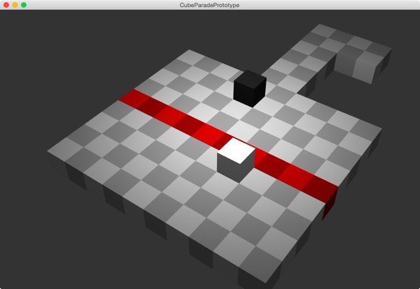

# プロトタイプ版 BRICK&TRIP
拙作アプリ[『BRICK&TRIP』](https://itunes.apple.com/us/app/brick-trip/id1051740912?l=ja&ls=1&mt=8)のプロトタイプ

アプリ制作に本格的に着手する前に、ゲーム本編を簡単に実装してプレイ感を確認しました。

+ マウスとキー入力でBRICKを操作
+ ステージクリア判定
+ お邪魔BRICK実装

本制作ではプロトタイプで書いたコードは全て捨て、いちから実装をおこなっています。

## How To Build
1. [公式サイト](http://libcinder.org)で配布されているCinderライブラリ(0.8.6)のフォルダを、プロジェクトと同じ場所に置く
1. プロジェクトファイルを開く
1. Let's enjoy!!

### 注意:Windows版
**VisualStudio2013** 必須。おそらくそれ以外のバージョンではビルドできません。

## Liense
License All source code files are licensed under the MPLv2.0 license

[MPLv2.0](https://www.mozilla.org/MPL/2.0/)
